AI Support Knowledge Assistant (RAG Application)

A Streamlit-based application that answers support questions using a custom Amazon Bedrock knowledge base.

This project implements Retrieval-Augmented Generation (RAG) by connecting a Streamlit user interface to an Amazon Bedrock Knowledge Base. User questions are sent to the knowledge base, relevant content is retrieved, and a foundation model generates a context-aware response.

## Features

- Ask support related questions in a simple web app
- Retrieve answers from a custom Amazon Bedrock knowledge base
- Generate responses using the Amazon Bedrock foundation model Nova Lite 1.0
- Built with Python, Streamlit, boto3, and AWS Bedrock

## Tech Stack

- Python
- Streamlit
- AWS Bedrock
- boto3

## How It Works

1. User enters a question in the Streamlit app
2. The app sends the request to Amazon Bedrock
3. The Knowledge Base retrieves relevant information
4. The model generates a response
5. The answer is displayed to the user

##Screenshots 

### Example Response: Password Reset
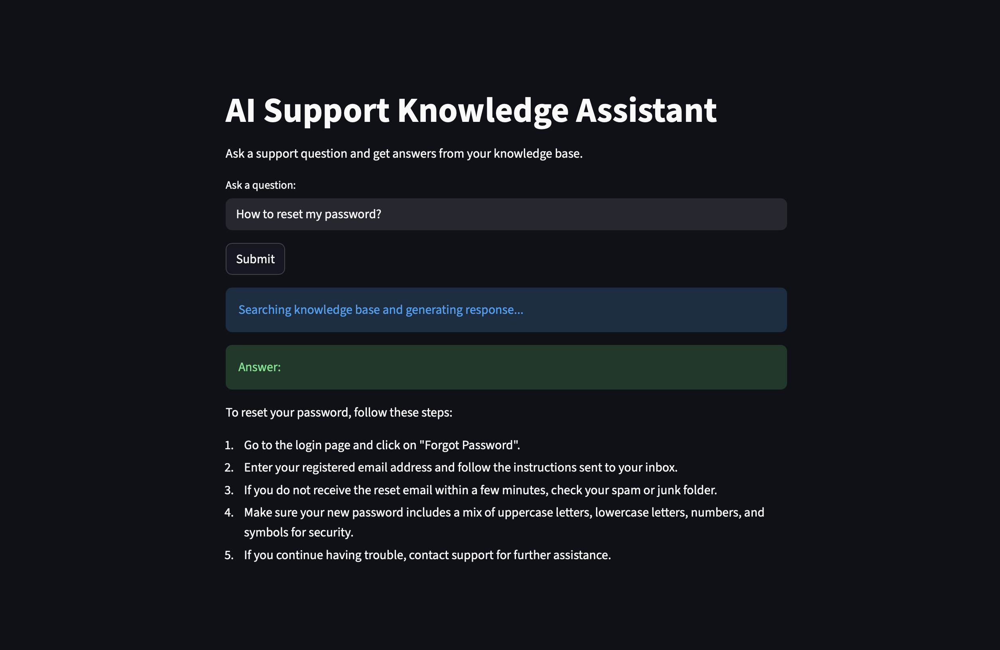

### Example Response: Payment Issue
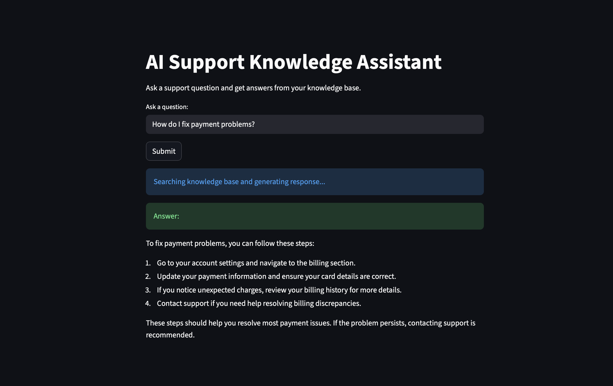

### Example Response: Account Security
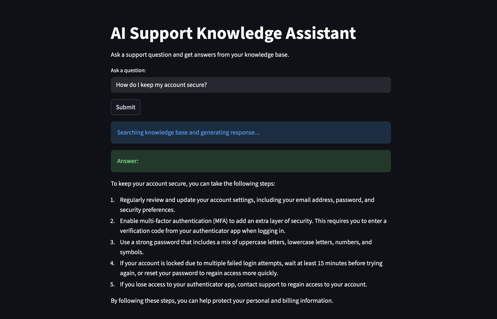

## AWS Setup (How It Was Built)

### Data Preparation

#### S3 File Upload
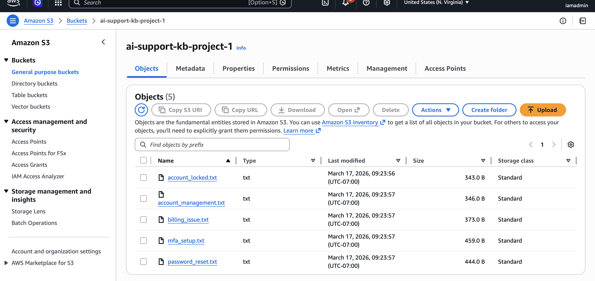

#### Indexed Documents
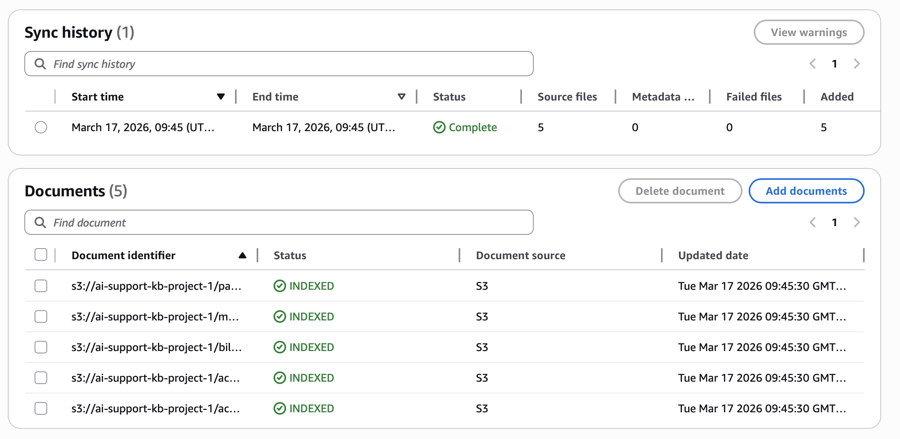

---

### Knowledge Base Setup

#### Knowledge Base Overview
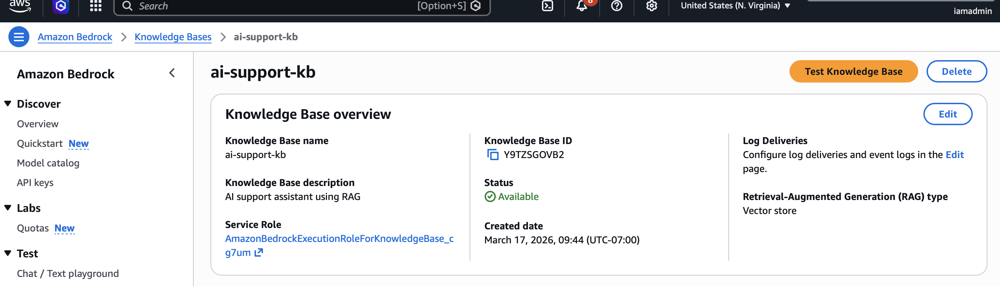

#### Data Source Configuration
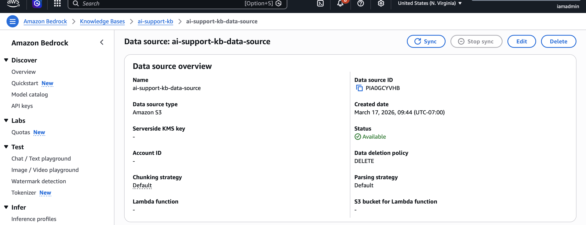

#### Knowledge Base Configuration
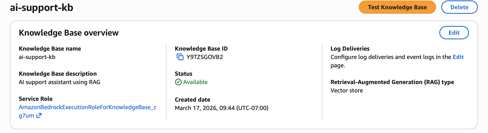

---

### Retrieval Configuration

#### Embeddings Configuration
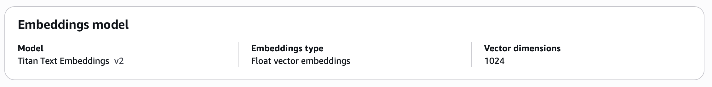

#### Vector Store Setup
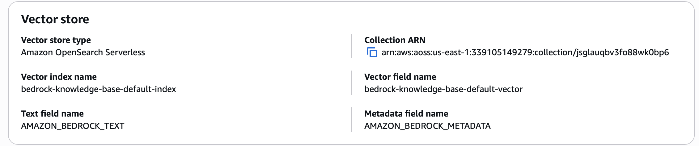

#### Model Selection
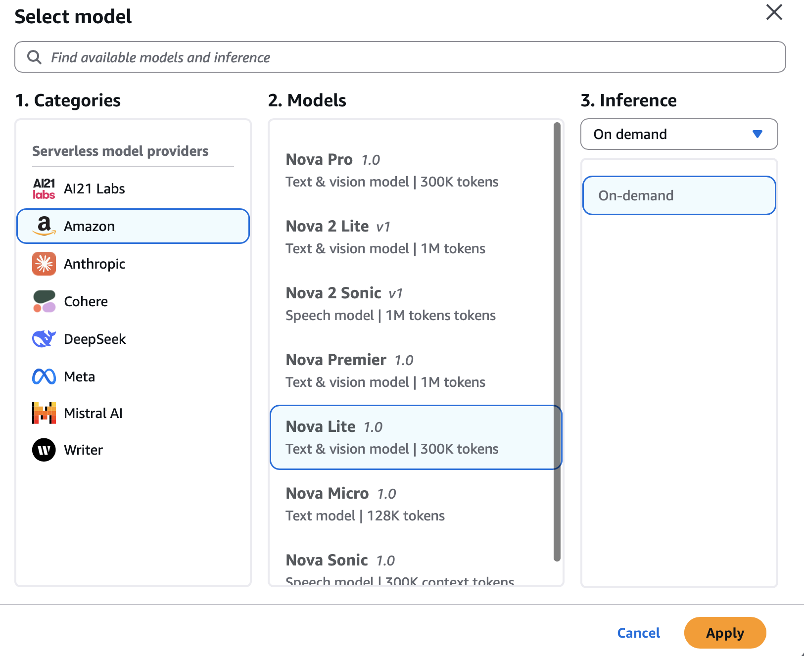

---

### Testing

#### Retrieval Test Output
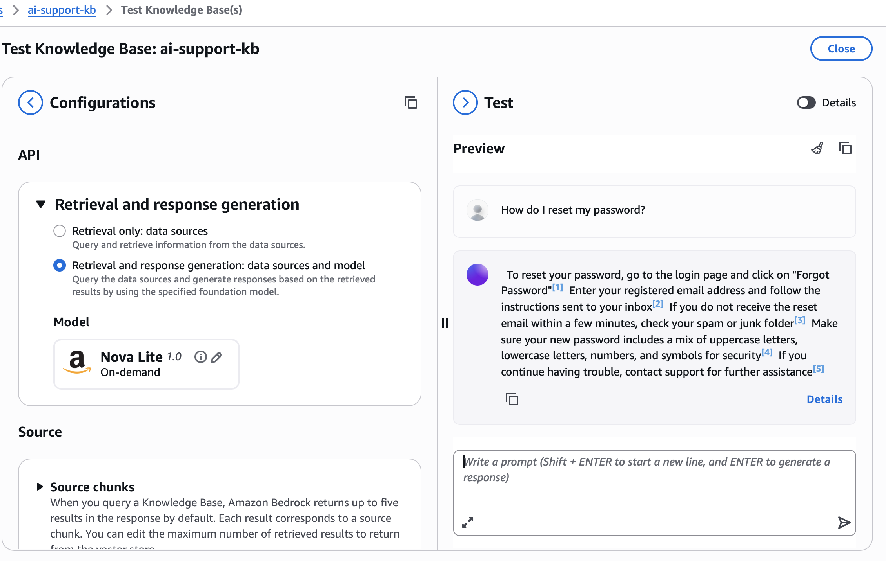
